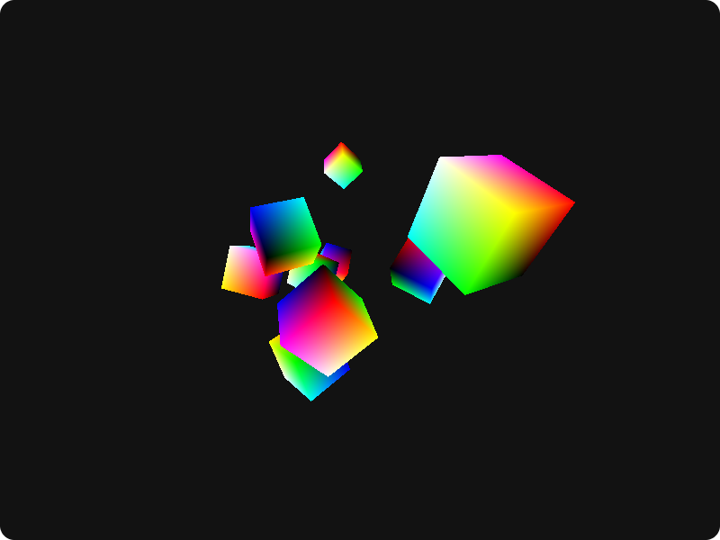
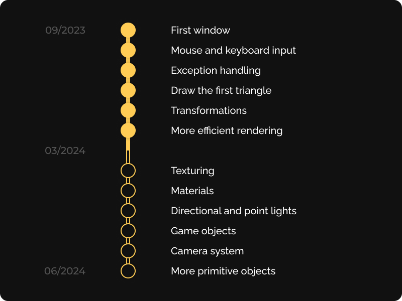

# Tower

A game engine in development, powered by DirectX11.

Fully implemented in C++ and HLSL, features proper exception handling.

## Description

This is half a hobby project and half a university assignment. The ultimate goal is to implement an engine that could serve as the foundation of a simple video game.

In its current state, the engine is capable of rendering multiple cubes that randomly move around the scene using 3D transformations. Although keyboard and mouse input is also being captured, it is not used yet.

Error handling is crucial during development and testing, so a solution is implemented in the engine that upon encountering a graphics-related exception, displays an informative error message queried from the DirectX API.

## Roadmap

### First window

Display an empty window when running the project using the DirectX API.

### Mouse and keyboard input

Maintain the full state of the keyboard and mouse keys. The state should be queried.

### Exception handling

Whenever the applications encounters an exception related to DirectX, a popup should be shown containing the description of the issue queried from the DirectX API.

### Draw the first triangle

Draw a triangle to the window using DirectX.

### Transformations

Using matrices, move, rotate and scale the rendered meshed.

### More efficient rendering

Reuse buffers if possible between frames.

### Texturing

Set different colors for different faces of meshes. Could be extended to support actual textures being loaded from file.

### Materials

A system for setting basic material parameters for objects, such as shininess and color.

### Directional and point lights

Shade the objects based on light coming from points (lamp) and set directions (sun), but without casting shadows.

### Game objects

Every object in the game should derive from the same super class.

### Camera system

The camera should be a game object with unique properties (i.e. transform, zoom, aspect ratio etc.). Support multiple cameras.

### More primitive objects

Support a variety of built-in primitive objects like plane, cube, sphere etc. Would be useful for showcasing the capabilities of the engine.
